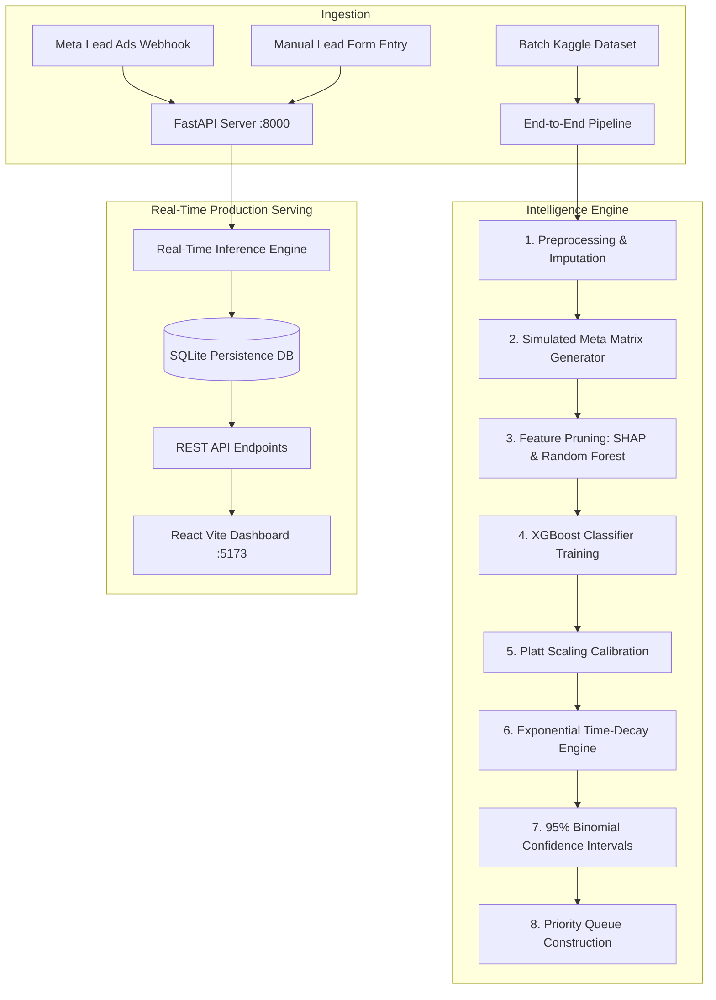

# 🏛️ MetaLeadIQ — System Architecture & Mathematical Foundations

MetaLeadIQ is an enterprise-grade Lead Scoring and Priority Queue system engineered specifically for high-velocity Meta (Facebook & Instagram) advertising campaigns.



---

## 📐 Mathematical Formulations

### 1. Base Conversion Probability ($P_{\text{base}}$)
The base probability that lead $i$ will convert into a paying customer is modeled via an XGBoost Gradient Boosted Tree Classifier:

$$P_{\text{base}}(Y_i = 1 \mid \mathbf{x}_i) = \sigma\left(\sum_{k=1}^K f_k(\mathbf{x}_i)\right)$$

where:
- $\mathbf{x}_i \in \mathbb{R}^{42}$ represents the selected feature vector (engagement features, lead sources, and occupation dummies).
- $f_k$ is the $k$-th regression tree minimizing regularized log-loss.
- $\sigma(z) = \frac{1}{1 + e^{-z}}$ is the standard logistic sigmoid link function.

---

### 2. Platt Scaling Calibration
Raw boosting probabilities can suffer from overconfidence. Platt scaling applies a calibrated logistic transform fitted on the held-out validation set $(\mathbf{X}_{\text{val}}, \mathbf{y}_{\text{val}})$:

$$P_{\text{cal}}(Y_i = 1 \mid P_{\text{base}}) = \frac{1}{1 + \exp(A \cdot P_{\text{base}} + B)}$$

Parameters $A$ and $B$ are estimated via maximum likelihood estimation to align predicted probabilities with empirical conversion frequency.

---

### 3. Exponential Time-Decay Engine
Lead responsiveness drops sharply with time uncontacted. MetaLeadIQ models lead score decay via an exponential half-life curve:

$$S_i(t) = S_{0, i} \cdot e^{-\lambda \Delta t_i}$$

where:
- $S_{0, i} = \text{round}(P_{\text{base}, i} \times 100) \in [0, 100]$ is the initial base score at form submission.
- $\Delta t_i$ is elapsed time uncontacted in hours:
  $$\Delta t_i = \frac{t_{\text{current}} - t_{\text{submission}}}{3600 \text{ sec}}$$
- $\lambda$ is the decay constant calibrated to a 24-hour half-life ($t_{1/2} = 24\text{h}$):
  $$\lambda = \frac{\ln(2)}{t_{1/2}} = \frac{0.693147}{24} \approx 0.028881 \text{ hr}^{-1}$$

#### Status State Machine:
- **Hot**: $S_i(t) \ge 70$ (Urgent action required; sales SLA < 15 mins)
- **Warm**: $40 \le S_i(t) < 70$ (Follow-up scheduled)
- **Cold**: $S_i(t) < 40$ (Enters automated email nurturing sequence)

---

### 4. 95% Binomial Confidence Intervals
To quantify statistical uncertainty for individual lead predictions, we compute the standard Wald binomial confidence margin:

$$\text{Margin}_i = 1.96 \cdot \sqrt{\frac{P_{\text{cal}, i}(1 - P_{\text{cal}, i})}{n_i}}$$

where:
- $n_i = n_{\text{base}} + \text{TotalVisits}_i$ models prediction stability based on behavioral sample depth.
- $\text{Bounds}_i = \left[\max(0, P_{\text{cal}, i} - \text{Margin}_i), \, \min(1, P_{\text{cal}, i} + \text{Margin}_i)\right]$

#### Confidence Categorization:
- **High**: $\text{Margin} \le 5.0\%$
- **Moderate**: $5.0\% < \text{Margin} \le 12.0\%$
- **Uncertain**: $\text{Margin} > 12.0\%$

---

### 5. Multi-Level Priority Queue Sort
Leads are ranked in the active sales queue using a hierarchical composite key:

$$\text{Rank}(i) \prec \text{Rank}(j) \iff \begin{cases} 
S_i(t) > S_j(t) \\
S_i(t) = S_j(t) \land \text{CPC}_i < \text{CPC}_j 
\end{cases}$$

This ensures sales reps always prioritize the **highest-scoring leads first**, and break ties in favor of leads with the **lowest acquisition cost (Cost-Per-Click)** to maximize campaign ROI.

---

## 🗄️ Database Schema (`metaleadiq.db`)

```sql
CREATE TABLE leads (
    id TEXT PRIMARY KEY,
    name TEXT NOT NULL,
    email TEXT,
    phone TEXT,
    lead_source TEXT DEFAULT 'Direct',
    lead_origin TEXT DEFAULT 'Unknown',
    placement TEXT DEFAULT 'Feed',
    audience_type TEXT DEFAULT 'Broad',
    ctr REAL DEFAULT 0.0,
    cpc REAL DEFAULT 0.0,
    creative_type TEXT DEFAULT 'Image',
    total_visits INTEGER DEFAULT 1,
    time_on_website REAL DEFAULT 0.0,
    page_views INTEGER DEFAULT 1,
    last_activity TEXT DEFAULT 'Page Visited',
    base_score INTEGER DEFAULT 50,
    base_probability REAL DEFAULT 0.5,
    calibrated_probability REAL DEFAULT 0.5,
    decayed_score INTEGER DEFAULT 50,
    hours_uncontacted REAL DEFAULT 0.0,
    status TEXT DEFAULT 'Warm',
    confidence TEXT DEFAULT 'Uncertain',
    prediction_lower INTEGER DEFAULT 40,
    prediction_upper INTEGER DEFAULT 60,
    submission_time TEXT,
    contacted INTEGER DEFAULT 0,
    contacted_at TEXT,
    created_at TEXT DEFAULT CURRENT_TIMESTAMP
);

CREATE INDEX idx_leads_score ON leads(decayed_score DESC, cpc ASC);
CREATE INDEX idx_leads_status ON leads(status);
```
