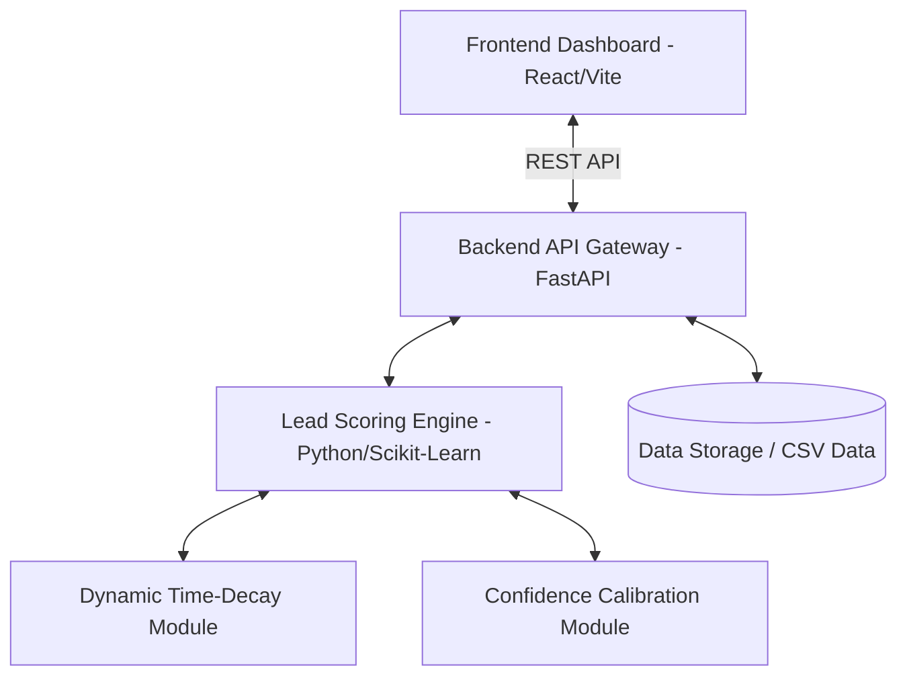

# Architecture Document: MetaLeadIQ

## 1. System Overview
MetaLeadIQ follows a modern, decoupled client-server architecture. It consists of a frontend web dashboard built with React and a backend machine learning and API engine built with Python. 

## 2. High-Level Architecture Diagram

## 3. Technology Stack

### 3.1. Frontend UI
* **Framework:** React 19 with Vite for fast builds and hot module replacement.
* **Language:** TypeScript for static typing and type safety.
* **Styling:** TailwindCSS for rapid, utility-first UI development.
* **Charting:** Recharts for rendering analytics and performance graphs.
* **Icons:** Lucide React for consistent UI iconography.

### 3.2. Backend & API
* **API Framework:** FastAPI for high-performance, asynchronous REST endpoints.
* **Language:** Python 3.x.
* **Machine Learning & Data Processing:** 
  * Pandas & NumPy for data manipulation and synthetic Meta ad metrics generation.
  * Scikit-Learn & SciPy for the baseline lead scoring model, survival analysis, and probability calibration.

## 4. Core System Components

### 4.1. Data Processing Pipeline
* Ingests the public Kaggle Leads dataset.
* Cleans and enriches data with simulated Meta advertising metrics (CTR, CPC, placements).
* Filters out non-essential dataset features.

### 4.2. Machine Learning Engine
* **Base Scorer:** Generates the initial 0-100 probability score based on lead attributes.
* **Time-Decay Engine:** Adjusts the base score downward over time to simulate loss of customer interest (Hot -> Warm -> Cold).
* **Confidence Calculator:** Computes statistical confidence bounds for each prediction to inform the sales representative of prediction reliability.

### 4.3. Web Dashboard (Client)
* Consumes the backend API to retrieve the dynamically ranked lead list.
* Renders interactive tables, individual lead detail views, countdown timers for decay, and visual analytics for campaign monitoring.
